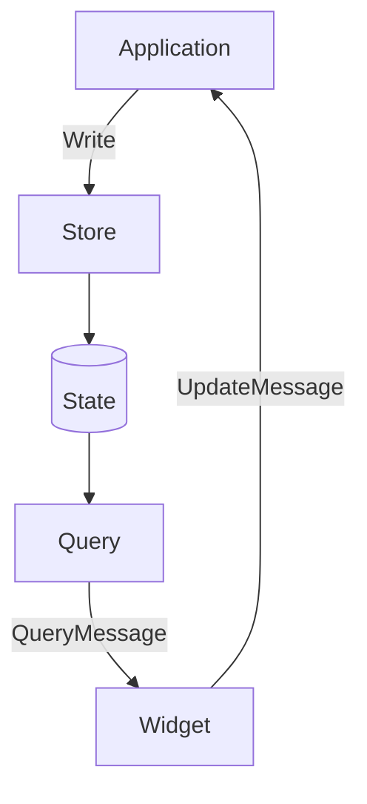
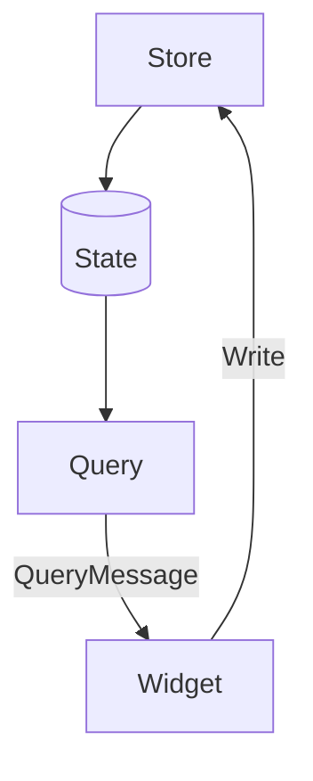

# Global Store: Focus

>>> ## Status: Discussing
>>> I am still discovering the best way to do this with Iced. I will update this RFC as I learn more, as I am lacking critical knowledge around the widget lifecycle and messaging.

## Summary

This proposal introduces a global store concept to facilitate shared state between widgets. The store is designed to be a single source of truth for a given widget tree. It is managed by a centralized controller and is accessible to all widgets in the application. The store is meant to be used as a domain oriented (widgets) state management tool and should not be used as a replacement for existing state management patterns.

## Motivation
### Why are we doing this?
Many projects need mouse, keyboard, and or gamepad interactions with Iced widgets. This will require a robust solution for focus management. I have found managing replicated state across the widgets to be an unruly pattern. I hope this RFC can help discover the best possible course of action for Iced even if it just starts a more serious conversation to another iteration of approach.

I have created an example of implementing focus with the current Iced API. The example can be found [Here](
https://github.com/jaunkst/iced/blob/core_widget_focus/examples/keyboard_navigation/src/main.rs). This example is a work in progress and is not meant to be a final solution. It is meant to be a starting point for discussion. It reveals some of the challenges of implementing focus with the current Iced API.

One of the challenges is keeping focus state in sync across the entire widget tree. This is a problem because the widget tree is mutable. The current solution is to replicate focus state across all focusable widgets in the widget tree. This is a viable solution but it is possible there are better approaches in handling focus.

### What use cases does it support? 
Creating a core widget library that supports mouse, keyboard, and or gamepad interactions.
Supporting future shared state requirements.

### What is the expected outcome?
We should be able to implement keyboard driven events to fully navigate and interact with an Iced UI with an agreed apon pattern, open discovery to a new RFC, or update the existing widgets to support this under the existing approach.

It would be desirable to implement a store pattern. This would allow focus state to be shared across the entire widget tree. It would also allow focus state to be updated in a single place and make it easier to keep state in sync across the entire widget tree.

# Lets Set Our "Focus" On The Store
It is important that we implement a healthy pattern to manage focus state across the entire widget tree. This will allow us to implement keyboard driven events to fully navigate and interact with an Iced UI.

The focus store is made up for a few parts.
- A state structure that stores the current focus state.
- A read trait that allows widgets to query the current focus state.
- A write trait that allows widgets to update the current focus state.

The widget would implement the read trait and the application would implement the write trait. This will allow the application to update the focus state and the widgets to query the focus state. Since the application is the only one that can update the focus state it can also handle the keyboard events and update the focus state.

> GOOD!


Widgets could also implement the write trait if they need to update the focus state. This would be useful for widgets that are not focusable. For example a button widget that would not be focusable but it could be used to navigate the widget tree. However this is usally bad practice and should be avoided.
> BAD!



The first thing we need to implement the write trait at the application level. This will allow the widget to update the focus state in the application state, but also allow Application itself to update the focus state on keyboard events.

> Application Level
```rs
impl FocusableWrite for State {
    /// Sets the focused `Id` to the one stored in this state.
    pub fn focus(&mut self) {
        widget::store::focus::focus(&self.id)
    }

    /// Sets the focused `Id` to `None`.
    pub fn unfocus(&mut self) {
        widget::store::focus::unfocus()
    }
}
```

Next we will implement a message type that will be used to update the focus state from a widget event.
```rs
pub enum Message {
    Focus(Id),
    Unfocus(Id),
}

fn update(&mut self, message: Message) -> Command<Message> {
    match message {
        Message::Focus(id:Id) => {
            widget::store::focus::set_focus(&id);
        }
        Message::Unfocus(id:Id) => {
            widget::store::focus::unset_focus(&id);
        }
    }
}
```

Now we need a unique Id for each focusable widget. This Id should be stored somewhere with your widgets internal state.
> Widget Level
```rs
struct State {
    id: Id
}

imple State {
    fn new() -> State {
        State {
            id: Some(Id::unique()),
            ..State::default()
        }
    }
}
```

Next we need implement a way to query the current focus state of the widget tree.

Lets also implement a read trait for on our widget.

> Widget Level
```rs
impl FocusableQuery for State {
    /// Returns true if the `Id` stored in this state is the focused one.
    pub fn is_focused(&self) -> bool {
        widget::store::focus::is_focused(&self.id)
    }

    pub fn on_focus(&mut self, message: Self::Message) -> Command<Self::Message> {
        // this is a no-op at this time
    }

    pub fn on_unfocus(&mut self, message: Self::Message) -> Command<Self::Message> {
        // this is a no-op at this time
    }
}
```

We should display the focused widget in some way to the user. This can be done by adding a border around the widget or changing the color of the widget.

Your draw function should implement something like this.

> Widget Level
```rs
// Is the mouse over the widget?
let is_hovered = bounds.contains(cursor_position);

// Is the widget focused?
let is_focused = state.is_focused();

// Determain the current state of the widget and set the style accordingly.
let mut styling = if !is_enabled {
    style_sheet.disabled(style)
} else  {
    match (is_focused, is_hovered) {
        (true, true) => style_sheet.focused_hovered(style),
        (true, false) => style_sheet.focused(style),
        (false, true) => style_sheet.hovered(style),
        (false, false) => style_sheet.active(style),
    }
};

```

By following this pattern we should be able to coordinate the focus state between the application and the widgets. This will allow us to implement keyboard driven events to fully navigate and interact with an Iced UI. While providing a healthy pattern that could be used for other shared state requirements in the future.

This is a common pattern that is used in other UI frameworks. 
### Keyboard Navigation

The first thing we need to do is implement a way to navigate the widget tree with the keyboard. This can be done by implementing the `Application` trait for your application `State` struct. This trait will be used to handle keyboard events and update the focus state of the widget tree through the subscription and update methods.

```rs
fn subscription(&self) -> Subscription<Message> {
    subscription::events_with(|event, status| match (event, status) {
        (
            iced::Event::Keyboard(keyboard::Event::KeyPressed {
                key_code: keyboard::KeyCode::Tab,
                modifiers: _,
                ..
            }),
            iced::event::Status::Ignored,
        ) => Some(Message::TabPressed),
        _ => None,
    })
}

fn update(&mut self, message: Message) -> Command<Message> {
    match message {
        Message::TabPressed => widget::store::focus::focus_next(),
    }
}
```

### Gamepad Navigation

Gamepad navigation is achived by remapping gamepad events to keyboard events. In this example I will be using an imaginary crate to handle gamepad events. This crate will be used to map gamepad events to keyboard events and then send them to the `Application` trait for handling via messages.

```rs
fn update(&mut self, message: Message) -> Command<Message> {
    match message {
        Message::DRight => widget::store::focus::focus_next(),
        Message::DLeft => widget::store::focus::focus_prev(),
        Message::DUp => widget::store::focus::focus_up(),
        Message::DDown => widget::store::focus::focus_down(),
        _ => (),
    }
}
```
As seen above we have mapped the directional pad on the gamepad to the keyboard events. This will allow us to navigate the widget tree with the gamepad. 

For keyboard mapping we would need to map the gamepad messages to keyboard events. At this this time we do not desire to solve for a multi-platform keyboard virualization. In my scenerio linux I would use the evdev crate to map the gamepad events to keyboard events. On windows I would use the winapi crate to map the gamepad events to keyboard events. On mac I would use the core-graphics crate to map the gamepad events to keyboard events. This is out of scope for this RFC.

> # Implementation strategy
> ## The details of how we store and retrieve the focus state should be discussed here. The following code is an example of how this could be implemented. This is not meant to be a final solution but a starting point for discussion.

>
> This is the most important part of the RFC. 
>
> Explain the design in sufficient detail that:
> - Its interaction with other features is clear.
> - It is reasonably clear how the feature would be implemented.
> - Corner cases are dissected by example.


### Focus Message
To update our widgets we will generate a message with the widget leaving focus, and then another with the widget receiving focus.

```rs
pub enum Message {
    Focused(Id),
    Unfocused(Id),
}
```

### Focusable Trait
The `Focusable` trait will be used to store the `Id` of the widget and provide methods to update state.

```rs
pub trait FocusableWrite {
    /// Set the `Id` stored in this state as the focused one.
    pub fn focus(&mut self);

    /// Set the `Id` stored in this state as None.
    pub fn unfocus(&mut self);
}
```
### Focusable Query Trait 
The `FocusableQuery` trait will be used to query the focus state of the widget tree.

```rs
pub trait FocusableQuery {
    pub fn is_focused(&self) -> bool;

    pub fn on_focus(&mut self, message: Self::Message) -> Command<Self::Message>;

    pub fn on_unfocus(&mut self, message: Self::Message) -> Command<Self::Message>;
}
```

> ## WARNING!! THIS IS ALL SPECULATIVE IMPLEMENTATION BELOW.
> ## BEGIN UNVETTED BRAIN DUMP

### Focus Store

The focus store will be used to store the current focus state of the widget tree. This will allow us to query the current focus state of the widget tree and update the focus state of the widget tree.

```rs
pub fn is_focused(id: &Id) -> bool {
    FOCUS.with(|focus| focus.borrow().as_ref() == Some(id))
}

pub fn focus(id: &Id) {
    FOCUS.with(|focus| focus.replace(Some(id.clone())));
}

pub fn unfocus(id: &Id) {
    FOCUS.with(|focus| focus.replace(None));
}
``` 


### Focus Next
This method will be used to focus the next widget in the widget tree.

```rs
pub fn focus_next() -> Message {
    let mut focus = FOCUS.with(|focus| focus.borrow().clone());
    let mut next = None;

    if let Some(id) = focus {
        let mut ids = IDS.with(|ids| ids.borrow().clone());
        let mut index = ids.iter().position(|i| i == &id).unwrap_or(0);

        if index < ids.len() - 1 {
            index += 1;
        } else {
            index = 0;
        }

        next = Some(ids[index].clone());
    } else {
        let ids = IDS.with(|ids| ids.borrow().clone());
        next = Some(ids[0].clone());
    }

    if let Some(id) = next {
        focus.replace(Some(id));
    }

    FOCUS.with(|focus| focus.replace(focus.clone()));
    Message::None
}
```

### Focus Prev
This is the same as `focus_next` but instead of incrementing the index we decrement it.

```rs
pub fn focus_prev() -> Message {
    let mut focus = FOCUS.with(|focus| focus.borrow().clone());
    let mut next = None;

    if let Some(id) = focus {
        let mut ids = IDS.with(|ids| ids.borrow().clone());
        let mut index = ids.iter().position(|i| i == &id).unwrap_or(0);

        if index > 0 {
            index -= 1;
        } else {
            index = ids.len() - 1;
        }

        next = Some(ids[index].clone());
    } else {
        let ids = IDS.with(|ids| ids.borrow().clone());
        next = Some(ids[0].clone());
    }

    if let Some(id) = next {
        focus.replace(Some(id));
    }

    FOCUS.with(|focus| focus.replace(focus.clone()));
    Message::None
}
```

### Focus Up
This is a bit more complicated than the other focus methods. This method will find the closest widget above the current focused widget and focus it. This will allow us to navigate the widget tree in a grid like fashion.

```rs
pub fn focus_up() -> Message {
    let mut focus = FOCUS.with(|focus| focus.borrow().clone());
    let mut next = None;

    if let Some(id) = focus {
        let mut ids = IDS.with(|ids| ids.borrow().clone());
        let mut index = ids.iter().position(|i| i == &id).unwrap_or(0);

        if index > 0 {
            index -= 1;
        } else {
            index = ids.len() - 1;
        }

        next = Some(ids[index].clone());
    } else {
        let ids = IDS.with(|ids| ids.borrow().clone());
        next = Some(ids[0].clone());
    }

    if let Some(id) = next {
        focus.replace(Some(id));
    }

    FOCUS.with(|focus| focus.replace(focus.clone()));
    Message::None
}
```

### Focus Down
This is a bit more complicated than the other focus methods. This method will find the closest widget below the current focused widget and focus it. This will allow us to navigate the widget tree in a grid like fashion.

```rs
pub fn focus_down() -> Message {
    let mut focus = FOCUS.with(|focus| focus.borrow().clone());
    let mut next = None;

    if let Some(id) = focus {
        let mut ids = IDS.with(|ids| ids.borrow().clone());
        let mut index = ids.iter().position(|i| i == &id).unwrap_or(0);

        if index < ids.len() - 1 {
            index += 1;
        } else {
            index = 0;
        }

        next = Some(ids[index].clone());
    } else {
        let ids = IDS.with(|ids| ids.borrow().clone());
        next = Some(ids[0].clone());
    }

    if let Some(id) = next {
        focus.replace(Some(id));
    }

    FOCUS.with(|focus| focus.replace(focus.clone()));
    Message::None
}
```
> ## END UNVETTED BRAIN DUMP
> The section should return to the examples given in the previous section, and explain more fully how the detailed proposal makes those examples work.
As your can see from the examples above, the `Focusable` trait will be used to store the focus state of a widget. The `FocusableQuery` trait will be used to query the focus state of a widget. The `focus_next`, `focus_prev`, `focus_up`, and `focus_down` methods will be used to update the focus state of the widget tree.


## How We Teach This
There are many simular existing guides and tutorials that can be used to teach this feature.
- This implementation is a feature rich variant of this pattern https://ngneat.github.io/elf/
- It is similar to Redux, but easier to use by avoiding use of actions and dispatchers.
- I can write documentation and best practices as part of the definition of done.

## Drawbacks
> Why should we *not* do this?

- If we desire complete purity and do not wish to share state between widgets, this will not work. However, I believe that this is a good compromise between purity and usability.
- If we desire to use a dispatchers and actions pattern, this will not work.
- This will not support decorating widgets not owned by the user with focusability. We would need to consider how to implement a handler pattern or something for this. This is also something that could be added later as a feature of `Widget`.

## Rationale and alternatives

> Why is this design the best in the space of possible designs?

- Very easy to use and understand. 
- Easy to replicate the pattern without getting it wrong.
- Flexible and can be used to implement focus on any widget.
- Allows for the user to implement their own focus logic if they desire.
- It wouldn't be a difficult guide to write. Easy to learn, easy to use.

> What other designs have been considered and what is the rationale for not choosing them?

- I have considered using a `Focus` widget to handle focus. This would allow the user to wrap any widget in a `Focus` widget and it would handle focus for that widget. This would be a bit more complicated to use and would require the user to wrap every widget they want to be focusable in a `Focus` widget. This also can leans to a much more complex and object oriented design. And would create diffcult patterns to follow. See Flutters: https://docs.flutter.dev/development/ui/advanced/focus
- I am in the favor of using a chain of responsiblity pattern or a handler pattern. This would allow the user to add focusability to any widget they desire in place of a complex proxy widget pattern.

> What is the impact of not doing this?

If we do not implement this, we will have to implement focus state on a widget by widget basis to achive this functionality. Or we will have to implement a dispatcher and action pattern to handle focus state. This will be more complicated to use and understand. And will be more difficult to implement.

The last option is to continue with the pattern we have now. This will be the easiest to implement but will be the most defect prone especially with third-party widgets bring in unknown internal state.

## [Optional] Prior art

> This section is intended to encourage you as an author to think about the lessons from other languages, provide readers of your RFC with a fuller picture. If there is no prior art, that is fine - your ideas are interesting to us whether they are brand new or if it is an adaptation from other languages.

Discuss prior art, both the good and the bad, in relation to this proposal.
A few examples of what this can include are:

> Does this feature exist in other GUI toolkits and what experience have their community had?

This is the most common pattern in GUI frameworks. Here is one recent implementation.
- https://ngneat.github.io/elf/

Redux or MobX are patterns are similar to this proposal. They are also used to store state in a global store. This proposal is similar to those patterns but it does not rely on action or dispatchers. It also does not require the user to implement their own actions and dispatchers. While promoting reusability.

> Are there any published papers or great posts that discuss this? If you have some relevant papers to refer to, this can serve as a more detailed theoretical background.

- https://netbasal.com/introducing-akita-a-new-state-management-pattern-for-angular-applications-f2f0fab5a8
- https://engineering.datorama.com/akita-react-hooks-a-recipe-for-sensational-state-management-2fd077c6237c

I don't think we are designing an entirely new pattern here. We are just applying a pattern that is already used in other domains to the GUI domain. We do not intend to reinvent the wheel or solve for a complete state management solution to application developers.

However it could be the start of a nice state management solution as it matures. I believe it is a strong foundation for a state management solution.

## Unresolved questions

> What parts of the design do you expect to resolve through the RFC process before this gets merged?
- What is the best data structure and lifetime for the focus store?
- I need a better understanding of the draw method and how it is called. I am not sure if it is called on every frame or if it is called when the widget is focused. If it is called on every frame, then we will need to modify the proposal to allow for that. I noticed that Iced does not redraw when watching my profiler so I think its safe to assume the draw is reactive to the state of the widget.

> What parts of the design do you expect to resolve through the implementation of this feature beore stabilization?
- The exact data structure and lifetime for the focus store. I really hope to get some feedback on this proposal and I hope to get some help implementing this feature. Especially with the draw method. I am not sure how to implement this feature without knowing how the draw method is called.

> What related issues do you consider out of scope for this RFC that could be addressed in the future independently of the solution that comes out of this RFC?
- Styling the focused widget. I think this is out of scope for this proposal. I have noticed that composing `Appearances` isn't very easy. I think this is something that should be addressed in the future. For example being in focus and hovered at the same time isnt as easy as merging the two appearances. This is due to the fact that rust doesn't offer a great way to destructure multiple structs at once. 

> ## [Optional] Future possibilities

- Developing and exposing a shared state pattern that can be used to store state in a global store. This would allow for the user to easily implement presistant state in their applications via a common pattern. This would obviously take another RFC and it might be an opportunity to create a more robust solution.
- This pattern can also reach full time travel debugging capabilities. This is a feature that is not currently supported by Iced but could be added in the future.