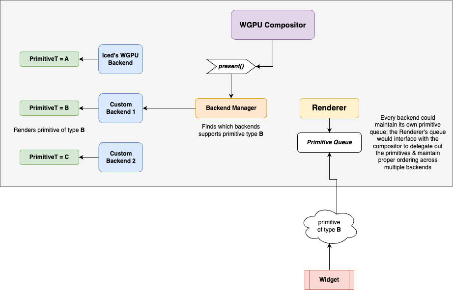

# 🌈 Custom WGPU Shaders & Pipelines 

## 📜 Summary

This RFC aims to reach a consensus on the following:
1) Should we integrate custom WGPU shader & pipeline support into Iced?
2) If so, to what extent? And how?

This RFC is similar to [RFC #19](https://github.com/iced-rs/rfcs/pull/19), but with a broader scope (for example, the 
custom shader proposed in #19 could be built on top of this framework!). The idea is to allow users to use their 
own WGPU pipelines & custom primitives to render their own content seamlessly alongside Iced's existing supported primitives.

**Please note that this RFC is working off of the changes already present in the `advanced-text` branch!**

## 🦾 Motivation

Currently, the only way to use a custom shader with Iced is to do something like the WGPU 
`integration` example, where you can render your own scene using Iced *independently* of the existing widget tree, 
or create a custom `Renderer` and do everything yourself. You must either render your content before or after Iced 
renders its user interface. This works in niche situations, for example a custom 3D scene with a 2d Iced overlay 
rendered on top, but if you wish to adjust the shader used to fill, for example, a container that exists deep 
within a widget tree, this is currently impossible without a fork or recreating the effect with potentially 
very expensive CPU calculations on a `Canvas`.

Adding custom WGPU shader & pipeline support to Iced will add extensibility, customizability, and modularity to the
existing rendering pipeline. I imagine a near future where we have repositories similar to `iced_aw`, where library
authors can provide their own pipeline integrations into Iced for all kinds of shaders, primitives, and even
post-processing effects! 🤯

Most GUI libraries out there allow some way of embedding the underlying graphics API calls alongside existing 
widgets for further customizability, an example being querying a raw `WebGL` context from a HTML5 canvas and 
doing what you will with it. I believe Iced would benefit immensely from this added functionality.

The result of this RFC should be that there is a clear path for allowing "embeddable" WGPU pipelines in some fashion 
to Iced, where library authors can create their own primitives & rendering pipelines which integrate seamlessly into 
Iced's existing renderer & backend.

## 🤠 Guide-level explanation

### 📚 Concepts

*Foreword:* Coming up with a strategy for adding custom pipeline support to Iced is not really about what, nor how, but 
*when*.
At what 
point in the frame presentation does the custom primitive get inserted into the primitive queue? Does it even get 
inserted into the primitive queue at all? If it's not inserted, how do we know when to render it? If it is inserted, 
what does a custom primitive actually mean? What *is* it? How do we reference the correct pipeline from the custom 
primitive? If the custom primitive has its own primitive type, do we use codegen/generics and just take the generic 
propagation L? Do we use reflection? Do we use trait objects & dynamic dispatching? Do we completely restructure 
Iced's rendering pipeline to allow for multiple backends of the same type? If so, how do we allow for any arbitrary 
amount of additive backends? Do we start getting down & dirty with macros to shave off a few additional pointer 
hops? Could we do this with a minimal unsafe abstraction layer? Should we even do this at all? Why am I doing this? 
*Why do I even exist?*


As you can see, this is a somewhat complex topic with a lot of tradeoffs between implementation strategies. Of 
course, I would love if there was a better idea floating around out there that I haven't thought of! That being 
said, **here are some of the concepts that you will need to understand before you can understand what this 
RFC aims to address.**

🖼 **Custom Pipelines**

This is essentially just a regular ol' wgpu pipeline implementation, except one that isn't already integrated into 
Iced! This can be as simple or complex as you want it to be. For example, in a prototype that I made to render a 
simple triangle, this was as simple as this struct:

```rust
pub struct CustomPipeline {
    pipeline: wgpu::RenderPipeline,
    vertices: wgpu::Buffer,
}
```

In Iced, `Primitive`s are mapped internally to the appropriate pipeline, though have no direct relationship to each 
other (for instance, a `Pipeline` doesn't have a primitive type `P`). Each is chosen manually for what is 
appropriate. There is currently also no abstraction for what a `Pipeline` actually is; by their nature they are all 
somewhat unique from each other, with minor underlying similarities (for example, every render pipeline must at some 
point allocate some data to a `wgpu::Buffer` & submit a `draw` command).


💠 **Custom Primitives**

What, exactly, pray tell, are we rendering? Ultimately this is some chunk of data that gets used by a custom 
pipeline. This could take the form of data that's passed directly to the existing `Primitive` enum (like 
current `Primitive`s are), or something as simple as a single pointer.

One implementation might mean that a custom primitive could be defined within the existing `Primitive` enum as just a 
pointer to some pipeline state that implements certain methods required for rendering.

```rust
pub enum Primitive {
    //...,
    Custom {
        id: u64, // a pipeline reference ID
        pipeline_init: fn(device: &wgpu::Device, format: wgpu::TextureFormat) -> Box<dyn Renderable + 'static>,
        // where "Renderable" defines a set of methods necessary for drawing
    }
}
```

Another implementation might define a custom primitive as a generic type that is unique to a `Renderer` or `Backend`.

```rust
pub trait Backend<Primitive> {
    //...
}
```

🧅 **Layers** 

In Iced, layering currently happens at the presentation level. Primitives are submitted to the `Renderer` in a 
queue-like fashion, and are then grouped before being drawn back to front. This allows primitives that are meant to be 
rendered together to be transformed together, somewhat like a scene. For example, when clipping primitives let's 
say in a `Canvas`, this will create a new layer. Note that every layer added to the layer stack will incur 
additional performance costs with pipeline switching & extra draw commands submitted to the GPU!

When considering a layering approach for custom primitives, we must think about how they are processed. Should a 
custom primitive be included in the existing `iced_wgpu::Layer` with some sort of ID matching?

```rust
pub struct Layer<'a> {
    //...
    // some kind of reference to what can be rendered in this layer that
    // we can match to a pipeline
    custom: Vec<PipelineId>,
}
```

Or perhaps we should enforce that all custom pipelines must group its supported primitives within its own layer? 
This needs some considering, but could be implemented further down the line as an optimization.

## 🎯 Implementation strategy

I've gone through a few ~~hundred~~ dozen implementation strategies. I'll share a few here:

### 🤾 Just throw a pointer at the `Renderer` 

You can view a small, very, *very* rough and unrefined prototype of this strategy [here](https://github.com/bungoboingo/iced/tree/custom-shader/pipeline-marker/examples/custom_shader/src). 

This example has a pointer-based approach, where the "state" of a pipeline & its associated primitive data is just 
stored as a heap allocated pointer within the existing `iced_wgpu::Backend`. Within a custom widget's `draw`, 
primitives are drawn like this:

```rust
//...
    renderer.draw_primitive(Primitive::Custom {
        bounds,
        pipeline: CustomPipeline {
            id: self.id,
            init: State::init,
        },
    })
```

Where `State::init` is a fn pointer with type signature:
```rust
pub init: fn(device: &wgpu::Device, format: wgpu::TextureFormat,) -> Box<dyn Renderable>
```

`Renderable` refers to a trait which allows a custom pipeline to call `prepare()` (for preparing data for 
rendering, similar to how we are doing it in every other pipeline we support in our existing `iced_wgpu::Backend`, e.
g. allocating & resizing wgpu buffers, writing uniform values, etc.). 

`Primitive::Custom` is then processed for inclusion in an `iced_wgpu::Layer`, where (if not already initialized) 
it's initialization (`init` above) is performed & added to a lookup map in the `iced_wgpu::Backend`. Then, come 
render time, if there are any `custom_primitives` within the `iced_wgpu::Layer`, we simply do a lookup for its 
pipeline pointer & call `prepare()` and `render()` as needed.

✅ **Pros of this strategy:**

- Simple to integrate into existing Iced infrastructure without major refactors.
- Performance is acceptable

❌ **Cons of this strategy:**

- Not flexible
  - Even with preparing this very simple example I found myself needing to adjust the `Renderable` trait to give me 
    more and more data unique to that pipeline that I needed for that specific render pass to render a cube.
- Feels kinda hacky
  - `Primitive::Custom` feels as though it doesn't really belong in the existing `iced_graphics::Primitive` enum, 
    but that's subjective!
- `prepare()` and `render()` calls must be dynamically dispatched every frame per-pipeline & thus cannot be inlined.

Overall I'm pretty unhappy with this implementation strategy, and feel as though it's too narrow for creating a truly 
flexible & modular system of adding custom shaders & pipelines to Iced.

### 🎨 Custom Shader Widget

Similar to how we currently have `Canvas` in Iced, this strategy would involve creating a custom widget which is 
dependent on `wgpu` that has its own `Program` where a user can define how to render their own custom primitive.

A custom shader widget might have a method that is defined like:

```rust
pub trait Program {
  type State: Default + 'static;

    fn render(
        &self,
        state: &Self::State,
        device: &wgpu::Device,
        encoder: &mut wgpu::CommandEncoder,
        //...
    );
```

Or something similar, which, when implemented, would allow a user to define how to render their custom `State`. I 
found that with this strategy, a `Primtive::Custom` wrapper of some kind was still needed, which ended up being 
pretty similar to the previous strategy and just replacing `iced_graphics::Renderable` with 
`iced_graphics::custom::Program`, so I did not finish a fully flushed out prototype.

✅ **Pros:**

- Users who are already familiar with `Canvas` might find this type of widget familiar & intuitive to use.
- More in line with Iced's style

And, like the previous strategy:
- Simple to integrate into existing Iced infrastructure without major refactors.
- Performance is acceptable, but worse than previous strategy

❌ **Cons:**
- Same cons as the previous strategy; very little flexibility, users must shoehorn their pipeline code to fit into 
  this very specific trait `Program` provided by Iced. 
- When I was prototyping this out, I found it nearly impossible to do this implementation without doing some kind of 
  reflection with `Program::State` in addition to the required dynamic dispatching. This could possibly not be a 
  real con as there might be a different, more performant way to do it!

### 🔠 Multiple Backend Support for Compositors

I have no prototype to speak of this with strategy; it will involve a good amount of restructuring, possibly some 
codegen for performance reasons, and some intermediate data structures added to the compositor. That being said, I 
believe this is more along the lines of a "correct" solution for integrating custom shaders & pipelines into Iced as 
it allows the most flexibility & feels the least hacky.

This strategy involves adding support for multiple `Backend`s per `Compositor`. See the diagram below for a rough 
outline of how it would work:



Every `Backend` (probably should be renamed to something more appropriate, like `Pipelines` or `PipelineManager` or 
something for clarity) would be responsible for its own primitive type that it can support. In the case of 
`iced_wgpu::Backend`, this would be the `iced_graphics::Primitive` enum. The command encoder would be passed down 
into every backend for recording before being submitted to the GPU.

This would require a few new concepts added to the wgpu `Compositor`:

💠 **Primitive Queue**

There must be a backend-aware queue which keeps track of the actual ordering of how primitives should be 
rendered across all backends. I believe this could be implemented fairly easily either by having each `Backend` keep 
track of its own queue and having some data structure delegate at the appropriate moment with some form of marker 
indicating that we need to start rendering on another `Backend`. Some kind of order-tracking data structure is 
essential for ensuring proper rendering order when there are multiple backends.

Widgets would request that their custom primitives be added to this queue when calling `renderer.draw_primitive()`.

👨‍💼 **Backend "Manager"**

This would essentially be responsible for initializing all the backends (lazily, perhaps!) & delegating the proper 
primitives to the multiple `Backend`s for rendering. This would be initialized with the `Compositor` on application 
start.

✅ **Pros:**
- Flexible, users can do whatever they want with their own custom `Backend`.
- Modular & additive; users can create a custom `Backend` library with their own primitives that it supports that 
  can be initialized with the  `Compositor`.
- For users wanting to use a custom primitive from another library, or one they made, they would use it very 
  similarly to how you use currently supported `Primitive`s in Iced, which would feel intuitive.

❌ **Cons:**
- Doing this strategy performantly without creating a bunch of trait objects might be challenging! At least just 
  from thinking about it for a few days I've not come up with that many ideas other than using a hefty amount of 
  codegen via generics or declarative macros.
- This would be quite a heavy refactor for the `iced_wgpu::Compositor`!
- This would (possibly?) preclude custom primitives being grouped together with other backend's primitives in 
  its own `Layer` for transformations, scaling, etc. which might be undesirable.

### 🤔 Other Ideas

I've had several ~~thousand~~ other ideas that I thought I'd give a brief mention. I've dismissed most of these as 
not being viable, but perhaps someone can think of a better way to implement them.

1) Primitive Concatenation with `#[primitive]` attribute macro

This idea would involve heavily ~~ab~~using proc macros to essentially "embed" Iced's primitives into a user's custom 
primitive type, allowing them to set the primitive type of a `Renderer` at compile time, and include Iced's already 
supported primitives, without needing dynamic dispatch. Library authors of custom primitives & pipelines could then 
provide their own macro, which would be embedded into the `#[primitive]` attribute macro to keep concatenating 
enums until you had a final `Primitive` type. This however feels like more of a hack than a real solution, at least 
to me!

2) Fck it, build script

This idea would involve a hefty amount of codegen to generate both the final `Primitive` type similar to above, and 
also the whole `Backend` with any custom pipelines embedded in it. This way a user has access to the exact same API 
as currently offered in Iced when working with custom primitives. Also dismissed due to hackiness, but some sort of 
build script might still be needed in the end (hopefully not to this extent!).

## 😶‍🌫️ Drawbacks

After prototyping out ideas for the last 2 weeks, I have come to the conclusion that whatever strategy we 
decide, unless we do a hefty bit of codegen, will ultimately be less performant than just forking Iced & adding a 
new pipeline/primitive directly to the existing WGPU backend. I'm of the opinion it's not a bad thing to fork a 
library if you want to add something that others might not want, so perhaps that is the real solution. It's 
certainly the simplest!

You *can* also use custom shaders right now with Iced, albeit in a limited way, so perhaps further integration is 
not needed. Perhaps we should look at a more composable way of creating a `Renderer` that can leverage already 
implemented support from Iced's `Renderer`s instead, or something along those lines.


## 🧐 Rationale and alternatives

I believe I've already addressed most of these pros & cons in the `Implementation` section above! I will say that the 
implications of *not* doing this is that Iced would continue to be one of the few GUI libraries that does not offer 
direct access to its rendering backend (e.g. the `wgpu::Device` and `wgpu::CommandEncoder`) or just the ability in 
general to embed graphics-api-specific content in its existing widget tree. I believe that not allowing users to 
leverage the GPU for more complex scenes alongside the ease of using Iced's built-in widgets and rendering pipelines 
would be tragic! 😿


## 🧑‍🎨 Prior art

The most prevalent example of this feature that I can think of is being able to get a direct `WebGL` context from a 
HTML5 `Canvas`, which allows users to render whatever they want (except things that use storage buffers! :P) on the 
web. This has allowed all kinds of content for the web that we didn't have before, like complex 3D scenes, whole 
games (RIP Flash), etc. that I think have made the web richer. Of course there is a performance implication of 
allowing such raw access on a platform which some might say is unoptimized for such tasks, but that is not really a 
consideration with Iced.

A lot of other GUI frameworks allow use of custom shaders via OOP & inheritance (for example, by simply extending a 
`Primitive` class or interface which defines how to draw itself). Obviously Iced's implementation will need to 
differ since it is a functional library (although some form of trait object might be needed). Any game engine out there 
allows custom shaders & entities, all submitted to one (or multiple) render queues.

Android allows for "shaders" using their own shader language, AGSL, which functions similar to Iced's `Canvas`, but 
also with GLSL and hooking directly into the GL context. They also use OOP & inheritance with a `GlSurfaceView` which 
extends `View` (which is the base abstract class for all Android widget tree elements). This allows users to 
interact with the (E)GL surface which provides a bounds that they can execute OpenGL commands within.

The common thread amongst all of these implementations is that advanced users can access a raw handle to the 
graphics backend and draw to a specific region that is integrated into the rest of the DOM or ECS or widget tree or 
w/e to enable advanced drawing capabilities leveraging the GPU. I think the benefits of this type of flexible 
integration are readily apparent!

## 😵‍💫 Unresolved questions

- What parts of the design do you expect to resolve through the RFC process before this gets merged?

I would expect that this RFC resolves the overall direction of integrating flexible custom shader & pipeline support 
into Iced. I'd like to discuss & settle on a game plan before committing real time to the final implementation.

- What parts of the design do you expect to resolve through the implementation of this feature before stabilization?

The exact implementation of the intermediary data structures (if needed!) for managing rendering order & backends, 
small things that pop up during implementation that weren't considered. Once the general design is agreed upon I 
think the implementation details can be iterated on in PRs or through discussion in this RFC/Discord.

- What related issues do you consider out of scope for this RFC that could be addressed in the future independently of the solution that comes out of this RFC?

I think any actual implementations of custom shaders would be built on-top of this RFC, possibly in a separate crate 
within the Iced organization.

## 🤖 Future possibilities

I think getting this design implemented correctly would open a huge number of doors for the Iced ecosystem. 
Being able to write your own shaders and create a custom widget which any user can plug into their own application 
and use seamlessly as part of Iced's widget tree is the ultimate form of customization.

### If you made it to the end, congratulations! 🥳

Now, let's discuss! 